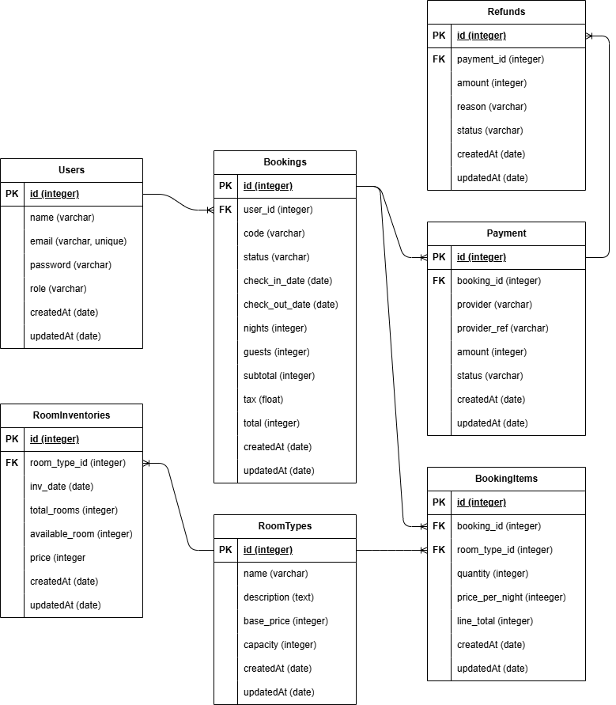

# Go Hotel Book

A modular, containerized hotel booking backend built with Go, Gin, GORM, and PostgreSQL. The system is split into microservices: Auth, Catalog, Booking, and Payment. Each service uses its own PostgreSQL schema via GORM NamingStrategy and communicates over HTTP where needed.

This repo includes ready-to-run Docker Compose, a Postman collection for API testing, and a Go workspace to develop services independently.



## Tech stack

- Go (Gin HTTP framework, GORM ORM)
- PostgreSQL (separate schemas: auth, catalog, booking, payment)
- JWT auth with HS256 (shared secret across services)
- Docker Compose for local runtime

## Services and ports

- Auth: issues JWTs for login and registration (port 8001)
- Catalog: room types and inventory, availability (port 8002)
- Booking: user bookings and lifecycle (create, list, detail, delete, check-in, check-out, refund) (port 8003)
- Payment: create payment, Webhook (Midtrans-mock), refund, list my payments (port 8004)

## Quickstart

1. Set environment variables

- A sample `.env` is included. Adjust as needed (DB and secrets):

```
DB_DSN=host=postgres user=postgres password=postgres dbname=go-hotel-book port=5432 sslmode=disable TimeZone=Asia/Jakarta
POSTGRES_USER=postgres
POSTGRES_PASSWORD=postgres
POSTGRES_DB=go-hotel-book
JWT_SECRET=RAHASIA
MIDTRANS_SERVER_KEY=Mid-server-xxxxxx
```

2. Start everything with Docker

From the `go-hotel-book/` folder:

```
docker-compose up -d --build
```

Services will be available at:

- Auth: http://localhost:8001
- Catalog: http://localhost:8002
- Booking: http://localhost:8003
- Payment: http://localhost:8004

Health checks:

- GET /health on each service

## Postman collection

Import the collection for a guided flow through the APIs:

- Preferred: `go-hotel-book/go-hotel-book.postman_collection.json`
- Legacy: `../go-hotel-book.postman_collection.json` (kept for reference)

Set these collection variables after importing:

- auth_base, catalog_base, booking_base, payment_base (default to localhost ports)
- access_token (set after login)
- booking_id, room_type_id, payment_id, order_id (from API responses when needed)
- check_in_iso, check_out_iso (ISO 8601 dates), amount

Suggested manual flow:

1. Auth → Register, then Login → copy access_token into collection variables.
2. Catalog → Seed (POST /internal/seed).
3. Catalog → Availability (GET /catalog/availability?check_in=YYYY-MM-DD&check_out=YYYY-MM-DD&guests=2) → pick a room_type_id.
4. Booking → Create Booking (POST /bookings) with Authorization and items → capture booking_id.
5. Payment → Create Payment (POST /bookings/{booking_id}/pay) with amount equal to booking.total.
6. Payment → Webhook: Midtrans Settlement (POST /payments/midtrans/webhook) with order_id=BO-{booking_id} to mark as paid.
7. Booking → Check In (POST /bookings/{id}/checkin) and later Check Out (POST /bookings/{id}/checkout).
8. Payment → Get My Payments (GET /payments) to see your history.

## API overview

URLs below are relative to each service base URL.

### Auth (8001)

- GET /health
- POST /api/v1/auth/register
  - Body: { full_name, email, password }
- POST /api/v1/auth/login
  - Body: { email, password }
  - Response: { access_token, user }

### Catalog (8002)

- GET /health
- POST /internal/seed
- GET /catalog/availability?check_in=YYYY-MM-DD&check_out=YYYY-MM-DD&guests=2

### Booking (8003)

All routes require Authorization: Bearer <token>

- GET /health
- GET /bookings → list my bookings
- POST /bookings → create booking
  - Body: { check_in, check_out, guests, full_name, items: [ { room_type_id, quantity } ] }
- GET /bookings/:id → my booking detail
- DELETE /bookings/:id → delete my booking
- POST /bookings/:id/checkin → mark as checked-in (requires PAID)
- POST /bookings/:id/checkout → mark as checked-out (requires CHECKED_IN)
- POST /bookings/:id/refund → cancel/refund
  - Body: { reason? }
- [Internal] POST /internal/bookings/:id/status → used by Payment service to set PAID/CANCELLED/REFUNDED

### Payment (8004)

Routes requiring Authorization: Bearer <token> are noted.

- GET /health
- POST /bookings/:id/pay (auth)
  - Body: { amount } — must match booking.total; returns { snap_token, redirect_url, amount }
- GET /payments (auth) → list my payments
- POST /payments/:id/refund (auth) → record a refund
- POST /payments/midtrans/webhook → public endpoint for webhook simulation
  - Body: { order_id, transaction_status, gross_amount, transaction_id, signature_key }

## Environment variables

All services read from `.env` via Docker Compose:

- POSTGRES_USER, POSTGRES_PASSWORD, POSTGRES_DB → for the Postgres container
- DB_DSN → used by all services, e.g. `host=postgres user=postgres password=postgres dbname=go-hotel-book port=5432 sslmode=disable TimeZone=Asia/Jakarta`
- JWT_SECRET → shared secret across Auth, Booking, Payment; must match
- MIDTRANS_SERVER_KEY, MIDTRANS_ENV → used by Payment (mock-friendly)
- Per-service schema via DB_SCHEMA:
  - auth → schema: auth
  - catalog → schema: catalog
  - booking → schema: booking
  - payment → schema: payment

Optional:

- BOOKING_BASE_URL (Payment) → base URL for Booking internal calls; defaults to http://booking:8003 inside Docker network.

## Database and schemas

Each service uses its own Postgres schema with GORM TablePrefix:

- auth.users
- catalog.room_types, catalog.room_inventories
- booking.bookings, booking.booking_items
- payment.payments, payment.refunds

Cross-service reads are schema-qualified. For example, Payment joins `payment.payments` with `booking.bookings` to list user payments. Currently payment.booking_id is stored as text, so queries cast booking UUIDs to text in joins.
